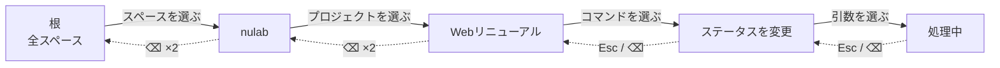
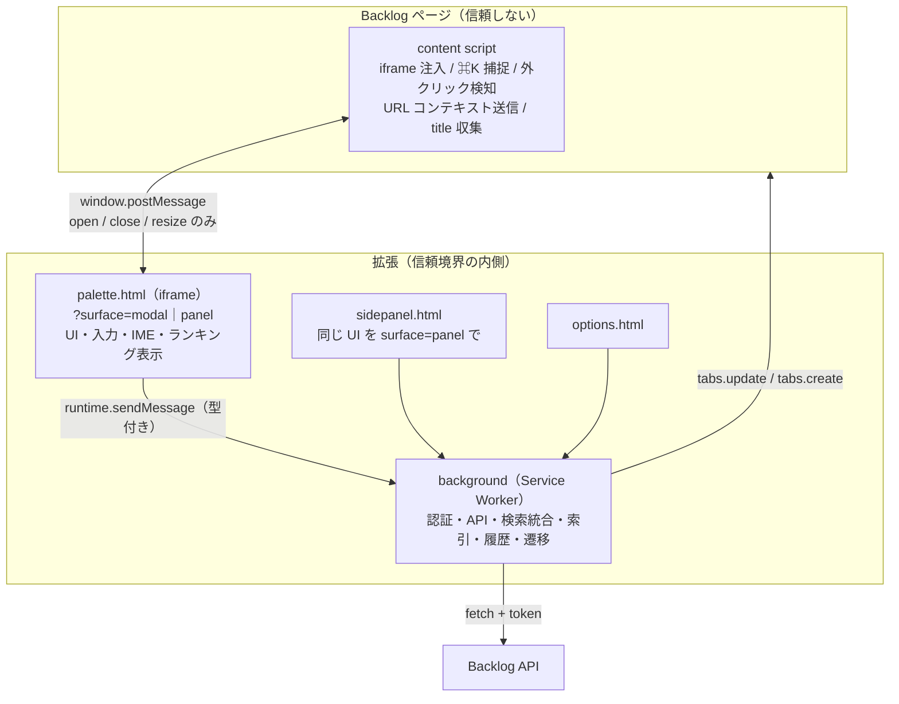
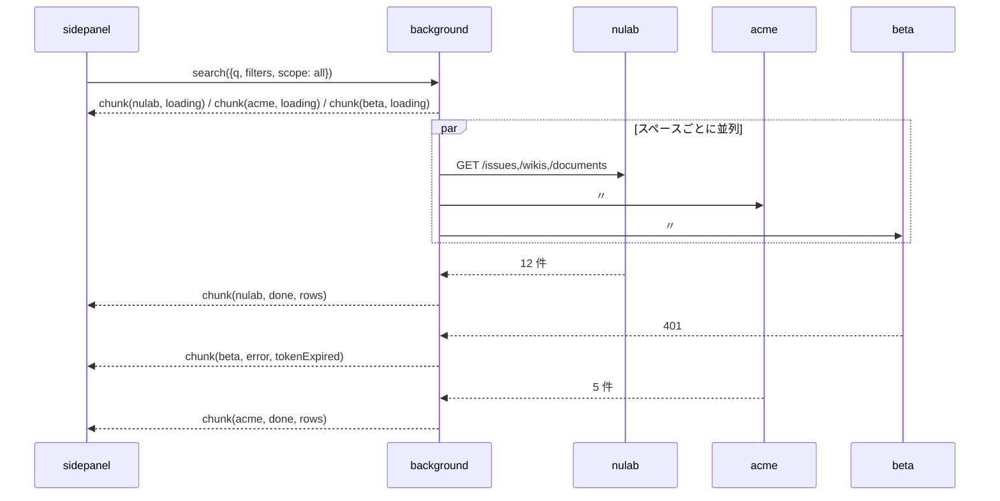

# Backlog Palette — 実装プラン / 設計 / アーキテクチャ

- 作成日: 2026-09-10
- 状態: 実装着手前の確定設計（この文書が実装の正典）
- 前提フレームワーク: [WXT](https://wxt.dev) 0.20 以降 / Manifest V3

## 0. この文書の位置づけと資料の統合方針

入力となった 3 つの資料は、それぞれ作られた時点が違い、内容が一部食い違っている。

| 資料 | 役割 | 扱い |
|---|---|---|
| [`reference/backlog-cmdk-extension-plan.md`](reference/backlog-cmdk-extension-plan.md) | プロダクト定義（背景・原則・機能・セキュリティ・ブランディング） | **原則と非交渉制約はここが正典**。UI の操作系は後発のモックに上書きされる |
| [`reference/backlog-palette-handoff.md`](reference/backlog-palette-handoff.md) | 実装への引き継ぎ（スコープ・技術選定案・未決事項） | スコープと未決事項リストの基礎。技術選定は本文書で確定させた |
| UI モック（A モーダル / B サイドパネル / C 周辺） | プロトタイプとして作成した画面モック | **操作系・画面構成・行の情報設計はここが正典**。ただし内部デザインシステムに依存していたため成果物はリポジトリに含めない。抽出した決定事項は §5 に転記済み |

**競合したときの規則**

1. 「体験の原則」（本文書 §2.2）と矛盾する案は、どの資料に書かれていても採らない
2. 原則と矛盾しない範囲では、**後発のモックが操作系の決定**を持つ
3. モックが答えていない挙動は本文書で決める。それでも決められないものは §18 に未決として置き、依存コードを書かない

この文書は §3 で矛盾の裁定を、§4–§16 で設計を、§17 で計画を、§18 で未決事項を扱う。

---

## 1. 何を作るのか（30 秒で読む要約）

Backlog（ヌーラボのプロジェクト管理 SaaS）向けのブラウザ拡張。`⌘K` / `Ctrl+K` ひとつで、キーボードだけでページ移動・課題ジャンプ・スペース横断検索を行う。

- **モーダル = 「行く」**: ローカル索引だけで即マッチ。打鍵ごとに API を叩かない。Enter で遷移して消える
- **サイドパネル = 「探す」**: 課題・Wiki・ドキュメントのキーワード検索。結果が残り、プレビュー・履歴・共有 URL を持つ
- 同一の UI を `?surface=modal` / `?surface=panel` で出し分ける（1 コンポーネント・2 サーフェス）
- 差別化の中心は**スペース横断**。本体実装では越えられない壁をここに置く

---

## 2. 確定した前提

### 2.1 想定ユーザー

1. **課題キーで会話する人**（開発者・PM）— `PROJ-1234` へ 1 日数十回飛ぶ
2. **複数スペースを横断する人**（受託 PM・情シス・管理者）— スペース／プロジェクト切替の往復が多い
3. **非開発職のヘビーユーザー**（ディレクター・営業事務）— 記号プレフィックスや暗記を要求すると離脱する

**3 番目の人が迷わないことを最優先**にする。これが密度・文言・ヒント表示の判断基準。

### 2.2 体験の原則（不変）

| # | 原則 | 実装への具体的な含意 |
|---|---|---|
| P1 | 覚えるのは `⌘K` だけ | プレフィックス（`>` `@` `#`）は加速装置。プレフィックスなしで同じ結果に到達できること |
| P2 | ナビゲーションと検索が先、書き込みは後 | Phase 1 に破壊的操作を入れない |
| P3 | 文脈を並びに反映する | frecency（頻度 × 直近性）と現在プロジェクトを順序に効かせる |
| P4 | 日本語 IME を一級市民として扱う | `isComposing` 判定、全角記号の受理、かな一致、変換確定 Enter で遷移しない |
| P5 | ヒントは省かない | フッターのキーヒントは常時表示。押した後も消さない |
| P6 | 筋肉記憶を壊さない | 同じ入力 → 同じ結果 → 同じ位置。非同期到着で選択行を動かさない（§8.5） |
| P7 | 本体より主張しない | Backlog のページに重なる前提。暗転と影だけで層を示す |

### 2.3 非交渉のセキュリティ制約

実装の都合で変更しない。変更が必要なら理由を添えて設計判断として起票する。

- パレット UI は content script が DOM を作らず、**拡張ページを iframe で表示**する
- content script が受け付けるメッセージは **`open` / `close` の 2 種のみ**（設計時は `resize` も含む 3 種だったが、パレットをビューポート全面のオーバーレイ iframe にしたため高さ同期が不要になった。減らす方向の変更）
- postMessage は**双方向で origin を検証**する。`targetOrigin` に `'*'` を使わない
- **認証情報・トークンは Service Worker のみが保持**する。UI にも content script にも渡さない
- どのスペースの認証情報を使うかは **Service Worker が `browser.tabs` からタブ URL を直接見て決める**。ページが送った値でトークンを選ばない
- 遷移は **iframe → Service Worker → `browser.tabs.update`**。ページ側を経由しない
- `web_accessible_resources` は `use_dynamic_url: true`。拡張ページの CSP は厳格化し、インラインスクリプトを使わない

---

## 3. 仕様書とモックの矛盾 — 裁定

実装前に潰しておくべき食い違いは 6 点。すべてモック側を採るが、理由を残す。

### D1. `Tab` はスコープ切替ではなく「候補の補完」

- 仕様書 5.5: 「`Tab` でスコープ切替」
- モック: 「**Tab は候補の補完に使います**」「⌫ 右端から 1 段戻す」

**裁定: モックを採る。** 理由 3 つ。

1. `Tab` を消費すると iframe 内のフォーカス移動が奪われ、キーボード操作の逃げ道がなくなる（P5・a11y）
2. IME 変換中の `Tab` は変換候補の操作に使われうるため、意味を持たせると誤爆する（P4）
3. スコープを「循環する列挙」から「積んで削るスタック」に変えた結果（D2）、切替という操作自体が存在しなくなった

**`Tab` = 入力中の語をリスト先頭候補のテキストで補完する**（入力欄にグレーで残りが見え、`⇥ で補完` のチップが出る）。仕様書 5.5 の Tab 行は破棄。

### D2. スコープは 3 段の列挙ではなく「パススタック」

- 仕様書 6.5: 「このプロジェクト → このスペース → 全スペース の 3 段。Tab で循環」
- モック A4/A5: 入力欄の中に `nulab / Webリニューアル /` のパスが積まれ、`⌫` で右端から 1 段ずつ外れる。根まで削ると `全スペース /` の 1 段になる

**裁定: モックを採る。** スコープは「値」ではなく「パス」。段数がそのまま範囲の広さを表す。

```
[全スペース /]                          ← 0 段（根）
[nulab /]                               ← 1 段: スペース
[nulab / Webリニューアル /]              ← 2 段: スペース + プロジェクト
```

- 削除は**右端から 1 段ずつ**。左だけを消すことはできない（意味の通らない組み合わせを作れない）
- `⌫` は 2 段階: 1 回目で右端に取り消し線 + 「もう一度 ⌫ で右端を削除」、2 回目で削除。**入力した日本語は消えない**（IME で打った文字が意図せず消える事故を防ぐ、P4）
- 循環しない。広げる（`⌫`）と狭める（候補から選ぶ）は別操作

### D3. コマンド階層も同じスタックに積む

モック A7 は `nulab / Webリニューアル / ステータスを変更 /` と、コマンドをスコープの続きとして積んでいる。

**裁定: スタックは 1 本。** セグメントに種別を持たせるだけで、`Esc` も `⌫` も「右端から 1 段戻す」という**同じ規則ひとつ**で説明できる。仕様書の「Esc で 1 階層戻る」「Backspace で前の階層へ」が別ルールに見えていた問題が解消する。

### D4. モーダルは属性で絞り込まない — 条件はサイドパネルに引き渡す

モック A8 が新規に持ち込んだ設計。仕様書には無い。

- モーダルは**ステータスや担当者で候補を作らない**（ローカル索引に属性インデックスを持たない）
- 「処理中 決済」のように**明らかにそれと分かる語**（ステータス名・「自分の」など）だけを条件として検出し、第一候補の中に外せるチップとして提示する
- `↵` = 条件つきでサイドパネル検索、`⌫` = 条件を外して語句のまま検索
- フッターは「絞り込みの調整はサイドパネルで」

**裁定: 採用。** モーダルの責務が「即応答するナビゲーション」に閉じ、属性インデックスの構築・同期という重い仕事がまるごと消える。実装が軽くなる方向の変更なので歓迎する。検出語彙の範囲は §18 の要決定事項。

### D5. サイドパネルは常設フィルターバーを持つ

モック B1/B2/B4 は、Backlog のプロジェクト横断検索と同等（スペース / プロジェクト / 種別 / ステータス / 担当者 / 更新日 / キーワード対象）の**常設フィルターバー**を持つ。仕様書は「スコープ 3 段 + 種別セクション」しか持っていなかった。

**裁定: 採用。** ただしモックが記録している制約を実装契約として明文化する。

- **条件はすべて AND**。Backlog の検索は OR ができないので、各条件は**単一選択（ラジオ）**
- OR が必要な現実の要求（「未対応か処理中」）は**プリセット**で吸収する: 「完了を除く」など
- **「キーワード対象」セレクタが未決事項 #1 の退避先になる**（§18-1）。`keyword` が件名のみだった場合、ここに「件名」「件名・本文（拡張側で照合）」を並べて、劣化をユーザーに見える形で提示する

### D6. 全スペース検索の並びはフラット固定。スペース単位の進捗は別レイヤー

ここだけモックを**そのまま実装しない**。

- 仕様書 6.5: 「フラットにスペースバッジ。グループ化しない」
- モック B2b: フラット + バッジ（仕様書と一致）
- モック B3: スペースごとのグループ見出しに件数 / 読み込み中 / 認証切れが並ぶ（**フラットと矛盾**）

**問題**: B3 のようにグループ見出しを結果リストに差し込むと、後から返ったスペースの結果が選択行より上に挿入され、**選択位置が動く**。P6（筋肉記憶）と Phase 1 完了条件「非同期で結果が追加されたときに選択位置がずれない」に正面から反する。

**裁定:**

1. 結果リストは**常にフラット + 右端スペースバッジ**。並びは現在スペース優先 → ランク → 更新日時
2. スペース単位の進捗・件数・エラーは、リスト**上部の固定ステータス帯**に出す（スペースチップ + 件数 / スピナー / 警告 + 再接続ボタン）。B3 の情報は失わずに、リストの外へ移す
3. **挿入規則**: 後から到着した結果は、現在の選択行より上に挿入しない。上位に入るべき結果は「N 件の新しい結果 — ↑ で先頭へ」の 1 行として先頭に予告し、ユーザーが選択を先頭に戻したときに初めて再ソートする

この 3 が Phase 1 の DoD を満たす唯一の形。モックに描かれていない挙動なので、実機で見せて合意を取る（§17 M4）。

### D7. React + React Aria Components。見た目は独立パッケージに切り出す

引き継ぎ資料は「バンドルサイズを重視するなら Preact」としていたが、パレットは iframe 内のローカル読み込みでネットワーク待ちが無く、サイズの効きが小さい。**React で確定**する。

UI は**挙動と見た目を分離**する。

| 層 | 採るもの | 理由 |
|---|---|---|
| 挙動・ARIA | `react-aria-components`（RAC） | `Autocomplete` が**仮想フォーカス**（入力欄がフォーカスを保ったままリストを矢印キーで辿る）を既定で持つ。これは §12 で自作しようとしていた `aria-activedescendant` 制御そのもので、IME 対応の土台になる。コマンドパレットの実装例が公式にある |
| 見た目 | 自前トークン層 + CSS Modules | 後から別のデザインシステムへ差し替える前提。トークンを 1 ファイルに閉じ、コンポーネントは意味のある役割名でしか色を参照しない |

`@adobe/react-spectrum` は**採らない**。同じチームの製品だが Adobe のビジュアルデザインが焼き付いており、後から見た目を差し替える前提と合わない。RAC は同じ挙動レイヤーを**スタイルなし**で提供するので、こちらを土台にする。

モックはプロトタイプとして内部デザインシステムで作られていた。**そのコードと資産はリポジトリに持ち込まない**。モックから引き継ぐのは情報設計（何をどの順で、どの粒度で見せるか）だけで、色・寸法・アイコンは本プロジェクトのトークンで組み直す（§8）。

---

## 4. 中核概念 — スタックモデル

この拡張の状態は、ほぼこの 1 つのデータ構造に集約される。ここを丁寧に作ればあとは表示層になる。



```ts
// core/stack/types.ts
type StackSegment =
  | { kind: 'space';      spaceId: SpaceId;    label: string }
  | { kind: 'project';    projectId: ProjectId; label: string }
  | { kind: 'command';    commandId: CommandId; label: string }
  | { kind: 'commandArg'; value: string;        label: string };

type Stack = {
  segments: StackSegment[];   // 左から右へ。右端が「今いる階層」
  armedForDelete: boolean;    // ⌫ 1 回目で true。取り消し線が付く
};
```

**不変条件**（ユニットテストで固定する）

- `space` の前に `project` は来ない。`project` は直前が `space` のときだけ積める
- 積む・右端を外す以外の操作を持たない（途中削除・並べ替えは存在しない）
- 検索スコープは `segments` から**導出**する。別の状態として持たない
- `armedForDelete` はキー入力・スタック変更・クエリ変更のいずれでも解除される

**スコープの導出**

| 段数 | 導出されるスコープ | 検索の投げ方 |
|---|---|---|
| 0（全スペース） | 接続済み全スペース | スペースごとに並列 |
| 1（スペース） | そのスペース全体 | 1 リクエスト |
| 2（スペース + プロジェクト） | そのプロジェクト | `projectId[]` 付き 1 リクエスト |

---

## 5. 画面仕様 → 実装コンポーネント対応

モックの各アートボードを、実装単位に割り当てる。**モックの寸法はハードコードしない**（日本語の長い件名、380px のサイドパネル、640px に収まらないキーヒントを想定する）。

### 5.1 モーダル（A 群）

| モック | 状態 | 実装で決めること |
|---|---|---|
| A1-a / A1-b | 空状態（見出しあり / 区切り線のみ） | **A1-a を採用**。非開発職が「何が並んでいるか」を言語で読めることを優先（P2 の想定ユーザー 3）。密度案 A1-b は設定で切り替えず、破棄 |
| A2 | ページ名入力中「ぼーど」（ダーク） | かな一致がローマ字変換なしで通ること。ページとコマンドを 1 つの順位表に混ぜる |
| A3 | 課題キー「PROJ-12」 | 直接ジャンプ候補を**常に最上位に固定**。個人化で動かさない |
| A4-a / A4-b | 自由テキスト / `⌫` armed 状態 | 第一候補は常に「サイドパネルで検索」。armed の取り消し線と警告色 |
| A5 | 全スペース（スタック 1 段） | フラット + スペースバッジ（D6） |
| A6 | 未接続スペースあり（ダーク） | 末尾 1 行に留める。バナーにしない |
| A7 | コマンド 2 段階（`›` の先） | スタックにコマンドを積む（D3）。フッターは「Esc 1 つ前に戻る」に差し替わる |
| A8 | 属性語入力「処理中 決済」 | 条件チップ + 引き渡し（D4） |

**共通構造**（`Palette Modal.dc.html` が契約）

```
┌─ header 54px ────────────────────────────────────────┐
│ 🔍  [nulab / Webリニューアル /]  クエリ▍ 補完 ⇥      esc 閉じる │
├─ list (padding 6px, gap 2px, max-height 可変) ──────┤
│ セクション見出し (700 10.5px / letter-spacing .08em) │
│ Result Row ×n                                        │
├─ footer 38px（bg-subtle, border-top） ───────────────┤
│ ↑↓ 移動   ↵ 開く   ⇥ 候補を補完   ⌫ 右端から 1 段戻す │
└──────────────────────────────────────────────────────┘
```

### 5.2 結果行（全サーフェス共通の唯一の行コンポーネント）

すべてのサーフェスが**この 1 コンポーネント**だけを使う。props は**表示の語彙だけ**で構成し、Backlog のドメイン語（課題・Wiki・スペース）を持ち込まない。ドメイン → props の変換は `core/view` の責務（§8.1）。

```ts
// packages/ui: Backlog を知らない
type ResultRowProps = {
  kind: RowKind;             // 'issue' | 'wiki' | 'document' | 'project' | 'space'
                             // | 'page' | 'command' | 'user' | 'connect' | 'filter' | 'external'
  code?: string;             // 等幅で出す短い識別子（例: PROJ-123）
  title: string;             // 1 行省略 + ellipsis
  sub?: string;              // 補足（· 区切りの平文。組み立ては呼び出し側）
  marker?: { label: string; tone: MarkerTone };   // 状態バッジ（ステータス相当）
  tag?: { label: string; tone: MarkerTone };      // 分類バッジ（課題種別相当）
  avatar?: { label: string };                     // 右端の出自バッジ（スペース相当）
  hint?: 'none' | 'enter' | 'modEnter' | 'more';  // more = `›` 2 段階操作
  selected?: boolean;
  tone?: 'default' | 'accent' | 'danger';
};

type MarkerTone = 'neutral' | 'info' | 'success' | 'done' | 'warning' | 'danger';
```

`status: '処理中'` ではなく `marker: { label: '処理中', tone: 'info' }` を渡す。**日本語のステータス名を UI パッケージが知らない**形にしておくことで、カスタムステータスも、将来の英語 UI も、デザインシステム差し替えも props 契約を変えずに通る。

固定する見た目の規則（モックから引き継ぐ。変えない）

- 選択行: 面の反転 + **左端 2px のアクセント罫** + タイトルの太字化。この 3 つで選択を示す
- `tone: 'accent'` は選択・非選択どちらでもアクセント面を敷く（第一候補の固定表示に使う）
- キーヒントは非選択行でも薄く残す（P5）。ホバーで初めて出す形にはしない
- 種別 → アイコンの写像は `packages/ui` の 1 箇所に閉じる（`kind` 以外でアイコンを指定させない）

ドメイン語 → 表示語の写像（`core/view` が持つ。デザインシステム差し替えの影響を受けない）

| Backlog の値 | `tone` |
|---|---|
| 未対応 | `neutral` |
| 処理中 | `info` |
| 処理済み | `success` |
| 完了 | `done` |
| カスタムステータス | Backlog が返す色から最も近い `tone` へ写す |
| 課題種別（タスク / バグ / 要望 / その他 / 運用） | 種別ごとに固定の `tone`。Backlog 側の色設定は見ない（プロジェクトごとに違うと学習できないため） |

### 5.3 サイドパネル（B 群）

| モック | 状態 | 実装で決めること |
|---|---|---|
| B1 | 狭い幅 380px | プレビューは選択行のインライン展開で代替。スペース／プロジェクトはアイコン画像のみで幅を条件に回す |
| B2-a | 720px 左リスト + 右プレビュー | 選択を動かしながら右を読み続けられること。ハイライト位置を本文冒頭に寄せる |
| B2-b | 別タブ 960px | セクション見出しを**種別タブ**（すべて 17 / 課題 12 / Wiki 3 / ドキュメント 2）に置き換え |
| B3 | スペース単位の逐次描画（ダーク） | **D6 の裁定でステータス帯に移す**。エラーは行内に閉じ、全体をエラー画面にしない |
| B4 | 0 件 | 原因を「スコープ」と「絞り込み条件」に切り分け、**効いている条件を外す提案を先頭**に置く |
| B5 | 検索 URL コピー直後のトースト | 何がコピーされたかを URL の実体で見せる。フッターのヒントは消さない |

**幅によるレイアウト切替**（1 コンポーネント・2 サーフェス）

| 幅 | フィルターバー | プレビュー | 種別の表現 |
|---|---|---|---|
| < 480px | compact（24px 高・11px） | 選択行のインライン展開 | セクション見出し |
| 480–860px | 通常（28px 高・12px） | 右ペイン | セクション見出し |
| > 860px | 通常 + キーワード対象 | 右ペイン（広め） | 種別タブ |

**B4 の「広げれば N 件」に関する注意**: モックは 0 件時に「このスペースで 5 件 / 全スペースで 11 件」と予告している。これは**より広いスコープへの投機的リクエスト**を意味し、レートリミットを消費する。実装方針は「0 件が確定した後に限り、1 スコープ 1 リクエストで件数のみ取得し、セッションキャッシュする。取得前は件数を伏せて『このスペースで検索しなおす』だけ出す」。予算が合わなければ件数表示を落とす（§18-11）。

### 5.4 周辺（C 群）

| モック | 内容 |
|---|---|
| C1 | 初回体験。未接続で `⌘K` → 説明を読ませず「このスペースを接続」の 1 行 + 主ボタン「OAuth で接続」／副「API キーで接続」 |
| C2 | 設定（オプションページ）。接続済みスペース一覧（方式・プロジェクト数・最終同期・要再接続）／ショートカット／学習トグル／課題キー優先トグル／ブラウザ履歴取り込み（オプトイン・権限説明つき）／履歴消去 |
| C3 | Backlog ページ上の全景。背景の薄暗転 + 影だけで層を示す（P7） |

---

## 6. 技術アーキテクチャ

### 6.1 実行コンテキストと境界



**責務の線引き**

| コンテキスト | やること | やらないこと |
|---|---|---|
| content script | iframe の注入・表示制御・高さ調整、`⌘K` 捕捉、ページ外クリック検知、現在 URL の送信、`document.title` からの表示キャッシュ収集 | API 呼び出し / 認証情報の保持 / ページ遷移 / パレット UI の DOM 生成 |
| palette（iframe / サイドパネル） | 入力・IME・候補描画・キーバインド・ローカル一致とランキングの**表示** | トークンの保持 / 直接の API 呼び出し |
| background | 認証・トークン更新、Backlog API、検索の並列統合、索引と行動ログ、`tabs.update` による遷移 | UI を持たない |

### 6.2 リポジトリ構成（pnpm workspace）

見た目を後から差し替える前提なので、**UI コンポーネントを独立パッケージに切り出す**。UI パッケージは拡張機能の API も Backlog のドメイン語も知らず、Storybook 単体で開発・確認できる。

```
backlog-palette/
├─ pnpm-workspace.yaml
├─ package.json                  # ルート: workspace スクリプトと devEngines のみ
├─ biome.json                    # lint + format（1 ツール）
├─ packages/
│  ├─ core/                      # ★ 純粋ロジック。ブラウザ API も React も知らない
│  │  └─ src/
│  │     ├─ stack/               #   スタックモデル（§4）
│  │     ├─ query/               #   入力の解釈（§7.1）: normalize / parse / detectConditions
│  │     ├─ match/               #   ファジー一致（かな・全角・プロジェクトキー）
│  │     ├─ rank/                #   frecency とタイブレーク（§7.3）
│  │     ├─ nav/                 #   ページ定義と URL 生成
│  │     ├─ share/               #   検索状態 ⇄ URL フラグメントのコーデック
│  │     └─ view/                #   ★ ドメイン → UI props の変換（唯一の接着面）
│  └─ ui/                        # ★ 見た目。Storybook で独立して開発する
│     ├─ .storybook/
│     └─ src/
│        ├─ tokens/              #   トークン層（差し替え時に書き換えるのはここだけ）
│        ├─ primitives/          #   Icon / Kbd / Badge / Avatar / Spinner / Toast
│        ├─ palette/             #   Row / PathStack / CommandInput / ResultList / Footer
│        ├─ panel/               #   FilterBar / StatusStrip / Preview / TypeTabs
│        └─ shell/               #   ModalShell / PanelShell（幅で出し分ける器）
├─ apps/
│  └─ extension/                 # WXT アプリ。core と ui を組み立てるだけ
│     ├─ wxt.config.ts
│     ├─ entrypoints/
│     │  ├─ background.ts        #   defineBackground（薄い。services を組む）
│     │  ├─ palette.content/     #   defineContentScript: iframe 注入 + ⌘K + title 収集
│     │  ├─ palette/index.html   #   → /palette.html（WAR に登録）
│     │  ├─ sidepanel.html       #   Chrome: side_panel / Firefox: sidebar_action
│     │  └─ options.html
│     └─ src/
│        ├─ services/            #   background 専用（auth / backlog / search / index / activity）
│        ├─ messaging/           #   ext.ts（UI ⇄ SW）/ window.ts（content ⇄ iframe）
│        └─ storage/             #   storage.defineItem のスキーマとマイグレーション
├─ e2e/                          # Playwright（.output/chrome-mv3 を読み込む）
└─ docs/
```

**依存の向き**（Biome の `noRestrictedImports` で機械的に守る）

```
ui   ←── extension ──→ core
     （ui は core を知らない / core は ui を知らない）
```

- `core` から外向きの依存を禁止（`wxt`・`react`・DOM を import しない）
- `ui` から `core` と `wxt` の import を禁止。props は表示語彙だけ（§5.2）
- 両者を繋ぐのは `core/view`（ドメイン → props）と `apps/extension`（配線）だけ

この分離が効くのは 2 箇所。**キーバインドと日本語入力の仕様をブラウザなしで固定できる**（`core` の Vitest）。**デザインシステムを差し替えるとき、書き換えるのは `ui` だけで済む**（`core` と `extension` は無変更）。

### 6.3 `wxt.config.ts`

```ts
import { defineConfig } from 'wxt';

const BACKLOG_MATCHES = ['https://*.backlog.jp/*', 'https://*.backlog.com/*'];

export default defineConfig({
  srcDir: '.',
  modules: ['@wxt-dev/module-react'],
  // 自動 import を使わない。どのモジュールから来た関数かを読める状態を保つ
  imports: false,
  manifest: ({ browser }) => ({
    name: 'Backlog Palette',
    permissions: ['storage', 'tabs', ...(browser === 'chrome' ? ['sidePanel'] : [])],
    optional_permissions: ['history'],
    host_permissions: BACKLOG_MATCHES,
    commands: {
      'open-palette': {
        suggested_key: { default: 'Ctrl+K', mac: 'Command+K' },
        description: 'Backlog Palette を開く',
      },
    },
    web_accessible_resources: [
      { resources: ['palette.html'], matches: BACKLOG_MATCHES, use_dynamic_url: true },
    ],
  }),
});
```

`@wxt-dev/i18n`（文言の外部化）と `@wxt-dev/auto-icons`（アイコン生成）は M6 で入れる。M0 の時点で入れるとロケールとアイコン素材が無いままビルドが落ちるだけで、得るものが無い。`optional_host_permissions` も Enterprise 対応（#12）に着手する時点で足す。

**WXT を使うことで消える作業**

- 複数エントリ（content / SW / palette / sidepanel / options）の manifest 生成とビルド設定
- サイドパネルのブラウザ差分: `entrypoints/sidepanel/index.html` 1 本から Chrome の `side_panel` と Firefox の `sidebar_action` を生成する
- iframe サーフェスの土台: `createIframeUi(ctx, { page: '/palette.html', position: 'overlay', anchor: 'body' })` が非交渉制約「拡張ページを iframe で表示」をそのまま実現する
- 開発時の content script HMR、`wxt build -b firefox`、`wxt zip` / `wxt submit`

**`wxt dev` でブラウザを自動起動するための前提**（踏んだので記録）

- `web-ext` は WXT の **optional peer dependency**。入れていないと `wxt dev` はビルドだけして「Load ... as an unpacked extension manually」と出て終わる。エラーではないので気づきにくい
- `webExt.chromiumProfile` のディレクトリは**事前に存在していないと起動に失敗する**（`chrome-launcher` が `userDataDir` 内の `chrome-out.log` を開くため ENOENT）。`server:created` フック（dev のときだけ走る）で作る
- プロファイルは使い捨てにせず `keepProfileChanges: true` で残す。接続済みスペース・表示キャッシュ・Backlog のログインセッションが再起動ごとに消えると、認証と個人化の確認に毎回 OAuth からやり直すことになる
- 起動時に開く URL は `BP_DEV_START_URL`（`.env`）で渡す。スペース名はリポジトリに書かない。**パレットはスペース上でしか動かない**ので、これを設定していないと新規タブで `⌘K` を押して「何も起きない」と誤解する
- Chrome 137 以降、branded な Chrome は `--load-extension` を無視する。ただし **web-ext 10 は CDP の `Extensions.loadUnpacked`（`--enable-unsafe-extension-debugging` 付き）を使う**ので branded Chrome でも読み込める。フォールバックが起きる環境向けに `BP_DEV_CHROME_BINARY` で Chrome for Testing を指せるようにしてある

**WXT を使っても自分でやる作業**（＝油断できない箇所）

- `use_dynamic_url: true` と CSP の厳格化は手書き（上記）
- `createIframeUi` は「常時注入・非表示・`open` で表示」という開閉制御を持たないので、`onMount` で `display: none` にして自前で制御する
- Enterprise カスタムドメインは静的 `matches` で拾えない。`optional_host_permissions` + `browser.scripting.registerContentScripts` で、ユーザーがスペースを登録したときに動的登録する
- **エントリポイント名の衝突は無言で落ちる**。`entrypoints/palette/index.html` と `entrypoints/palette.content/index.ts` は内部名がどちらも `palette` になり、content script が警告なしにビルドから消える。実際に踏んだので content script は `palette-host.content` に置いた。**ビルド後に `manifest.json` を目で確認する**のを手順に含める
- **`matches` の `*.backlog.com` は apex ドメインと `www` にもマッチする**。ヌーラボのマーケティングサイトはスペースではないので `excludeMatches` で除く。コード側の `isTrustedPageOrigin` と対で維持しないと、「content script は注入されるがパレットがメッセージを拒否し、透明なオーバーレイだけがページを覆う」という最悪の壊れ方をする（実際に踏んだ）

### 6.3.1 ツールチェーン

| 用途 | 採るもの | 補足 |
|---|---|---|
| ランタイム供給 | `mise.toml`（Node 24.21.0 / pnpm 11.25.0） | 強制は `package.json` の `devEngines`。pnpm の設定は `pnpm-workspace.yaml` 側（pnpm 11 で `package.json` の `pnpm` フィールドは読まれない） |
| パッケージ管理 | pnpm workspace | ビルドスクリプトは `allowBuilds` で明示許可した依存だけ実行できる |
| 型 | TypeScript 7 | `erasableSyntaxOnly` + `verbatimModuleSyntax` + 拡張子付き import で、型検査とトランスパイルの意味を一致させる |
| lint / format | Biome 2 | パッケージ境界（§6.2）を `noRestrictedImports` で機械的に守る |
| テスト | Vitest 5 / Playwright（E2E） | `packages/core` はブラウザ不要 |
| UI 開発 | Storybook 10（Vite builder） | `packages/ui` を単体開発する（§8.2） |
| ブラウザ自動起動 | `web-ext` 10 | WXT の optional peer dependency。§6.3 の前提を満たさないと起動しない |

**品質ゲートは CI に置き、ローカルで二重化しない。** pre-commit フックは入れない。ローカルの検査は「今書いたコードの答え合わせ」として範囲を絞って使う。CI が呼ぶのは `pnpm check` / `pnpm -r typecheck` / `pnpm -r test` / `pnpm -r build` の 4 つで、ルートの script はこの形を保つ。

### 6.4 メッセージ契約

**content ⇄ iframe（window.postMessage）— 3 種のみ**

```ts
// apps/extension/src/messaging/window.ts
type ToIframe   = { t: 'open'; ctx: PageContext } | { t: 'close' };
type FromIframe = { t: 'close' };

type PageContext = {           // すべて「ヒント」。認証の選択には使わない（§2.3）
  origin: string;
  spaceKey?: string;
  projectKey?: string;
  issueKey?: string;
  pageKind?: PageKind;
};
```

検証は両方向で必須。

- content 側: `event.source === iframe.contentWindow` **かつ** `event.origin === browser.runtime.getURL('').slice(0, -1)`
- iframe 側: `event.origin` が登録済みスペースのオリジン（`*.backlog.jp` / `*.backlog.com` / 登録済みカスタムドメイン）に一致するものだけ処理
- 送信時は常に `targetOrigin` を明示

**UI ⇄ SW（`@webext-core/messaging`）**

```ts
type ExtProtocol = {
  getBootstrap(surface: Surface): BootstrapState;      // 接続スペース・マスタ・空状態の素材
  localCandidates(req: LocalQuery): Candidate[];       // ローカル索引のみ（API を叩かない）
  search(req: SearchRequest): void;                    // 結果は searchChunk で push
  navigate(req: NavigateRequest): void;                // tabs.update / tabs.create
  runCommand(req: CommandRequest): CommandResult;
  recordActivity(ev: ActivityEvent): void;
  connectSpace(req: ConnectRequest): SpaceConnection;
};
// SW → UI（push）
type ExtEvents = {
  searchChunk: { requestId: string; spaceId: SpaceId; state: 'loading' | 'done' | 'error'; rows?: Row[]; error?: SearchError };
  connectionChanged: { spaceId: SpaceId; state: ConnectionState };
};
```

検索は**リクエスト / レスポンスではなく push ストリーム**にする。これがスペース単位の逐次描画（B3 → D6 のステータス帯）の前提。

---

## 7. コアロジックの設計

### 7.1 入力の解釈

プレフィックスは**任意の加速装置**（P1）。既定は自動判定。

| 入力 | 判定 | 出す候補 |
|---|---|---|
| `PROJ-123` | 課題キー（登録済みプロジェクトキー + `-` + 数字） | 直接ジャンプを最上位に固定（`tone: accent`）。下に前方一致 |
| `123` | 数字のみ | 現在プロジェクトの課題として補完 |
| ステータス名等を含む | 属性語 + 語句（D4） | 条件チップつき「サイドパネルで検索」を最上位 |
| 通常テキスト | 自由語 | 最上位に「サイドパネルで検索」、下にローカル一致（ページ・プロジェクト・コマンド・最近開いた項目） |
| 一致なし | — | 「サイドパネルで検索」のみ残す。パネル側でも 0 件なら本体全体検索へ逃がす |

加速プレフィックス（全角も受理）: `>` コマンドのみ / `@` ユーザー → 担当課題 / `#` プロジェクトのみ / `space:acme` 特定スペース。

**正規化パイプライン**（`core/query/normalize.ts`。1 箇所に閉じる）

1. NFKC で全角英数・全角記号（`＞ ／ ＠ ＃`）を半角へ
2. カタカナ → ひらがな、長音・小書き文字の揺れを吸収
3. 大文字小文字を無視（ただし課題キー判定は元の文字列で行う）
4. 日本語プロジェクト名に対し、**プロジェクトキー（英字）でもマッチ**するよう索引に別名を持たせる

ローマ字 → かな変換（`kyak` → 顧客）は Phase 2。

### 7.2 一致（ファジー）

- 対象は**ローカル索引だけ**（ページ定義・コマンド・プロジェクト・スペース・ユーザー・表示キャッシュ）。API を打鍵ごとに叩かない
- 既製ライブラリは英語前提のものが多く、かな・全角の前処理と相性が悪い。**前処理 + 部分列一致 + 連続一致ボーナス**の自前実装（100 行程度）で始め、実測で不足したら差し替える
- 予算: 索引 5,000 件に対し 1 打鍵 16ms 未満（1 フレーム）

### 7.3 ランキング

```
score(item) = base(matchQuality) + w_f · frecency(item) + w_c · contextBoost(item)

frecency(item) = Σ_events  weight(kind) · 0.5 ^ (age_days / HALF_LIFE)
```

- `HALF_LIFE = 14 日`（初期値。実測で調整）
- `weight`: 開いた 1.0 / パレットから選んだ 1.5 / プレビューのみ 0.3 / キャンセル −0.2
- `contextBoost`: 現在プロジェクト +、現在スペース +

**並びへの介入ルール（P6 を守るための不変条件）**

1. **課題キー完全一致・コマンド名完全一致は個人化で動かさない**（常に最上位）
2. 個人化はセクション内の並びにだけ効かせる。**セクションの順序は固定**
3. 「最近」と「よく使う」は別セクションにして混ぜない
4. 学習が決め手になるのは**同点・曖昧な場合のみ**

これら 4 つは `tests/unit/rank/` に「仕様」として書く（例: 「課題キー完全一致は、他の候補の frecency がどれだけ高くても先頭に出る」）。

### 7.4 検索オーケストレーション（サイドパネル）



- 種別ごと・スペースごとに並列。返ってきた順に**ステータス帯**を更新し、行はフラットリストへ**選択行より下にだけ**追加する（D6-3）
- 検索は `Enter` で明示実行。打鍵ごとの自動検索はしない。サジェストは履歴とローカル索引のみ
- レートリミットは**スペース単位で独立**に制御（トークンバケット）。既定スコープは「今のスペース」
- 1 スペースの遅延・認証切れ・レート超過は**その行だけのエラー**。パレット全体をエラー画面にしない
- 同一クエリ + 同一条件はセッション内キャッシュ。マスタ（プロジェクト・ユーザー）は起動時に先読み

### 7.5 検索状態の URL 共有

```
https://{space}.backlog.com/dashboard#bl-search=<base64url(JSON)>
```

- フラグメントなのでサーバーに送られない。拡張を入れていない相手も**普通の Backlog ページとして開ける**（壊れない）
- ペイロードに `v`（スキーマ版）を持たせ、未知の版は「この共有リンクは新しい版です」と伝えて無視する
- 復元時、フラグメントは content script 経由で届く**ページ由来の値**なので、スコープと条件の初期値にのみ使う。認証の選択には使わない（§2.3）

---

## 8. UI コンポーネントライブラリ（`packages/ui`）

モックはプロトタイプとして内部デザインシステムで作られていた。**その資産は使わない**。本番の見た目は後から調整する前提で、**差し替えのコストが最小になる構造**を先に作る。

### 8.1 3 層に分ける

| 層 | 中身 | 差し替え時 |
|---|---|---|
| **挙動** | `react-aria-components`（Autocomplete / ListBox / Menu / Dialog / Tabs / Switch / Popover / Tooltip / Toast） | 変えない。ARIA と仮想フォーカスはここに任せる |
| **構造** | 本プロジェクトのコンポーネント。要素の並び・階層・状態の持ち方 | ほぼ変えない |
| **見た目** | `src/tokens/` の CSS カスタムプロパティ + CSS Modules | **ここだけ書き換える** |

コンポーネントは**トークン名でしか色・寸法を参照しない**。hex・生の px フォントサイズ・font-family をコンポーネント側に書かない（Biome のルールで機械的に禁止する）。

```
--bp-surface-floating   パレット本体の面
--bp-surface-sunken     フッター・ステータス帯
--bp-row-selected       選択行の面
--bp-accent             アクセント（左罫・第一候補）
--bp-text-default / -subtle / -disabled
--bp-marker-{neutral|info|success|done|warning|danger}-{bg|dot}
--bp-radius-{control|surface|pill}
--bp-space-{1..8}       4px 刻み
```

`--bp-marker-*` のように**役割で名前を付ける**のが差し替え可能性の要点。`--bp-marker-info` が青である必要はなく、将来のデザインシステムが「処理中」に別の色を割り当てても、コンポーネントは無変更で追従する。

### 8.2 Storybook で独立して作る

- Storybook（Vite builder）で `packages/ui` を単体開発する。拡張機能をビルドせずに全状態を並べられる
- **モックのアートボードがそのまま Story になる**: `ModalShell` に A1-a / A2 / A3 / A4-a / A4-b / A5 / A6 / A7 / A8、`PanelShell` に B1 / B2-a / B2-b / B3 / B4 / B5。フィクスチャは `src/fixtures/` に日本語の現実的なダミーで置く
- 全 Story に **light / dark** と **幅**（380 / 640 / 720 / 960px）のバリエーションを持たせる。§5.3 のレイアウト切替が全部 Storybook で確認できる
- a11y アドオンを入れ、キーボード到達性とコントラストを Story 単位で検査する（CI が回す）
- **見た目の調整はここで完結する**。拡張機能を起動せずにデザイナーと画面を見て詰められることが、この分離の一番の実利

### 8.3 アイコン

内部デザインシステムのアイコンセットは使えないので、`lucide-react` を採る（MIT・tree-shakable・線の太さが均質で日本語 UI に馴染む）。`kind` → アイコンの写像は `packages/ui` の 1 ファイルに閉じ、呼び出し側にアイコン名を渡させない（§5.2）。将来アイコンセットを差し替えるときも、書き換えるのはその 1 ファイル。

### 8.4 テーマ

- ルートに `data-color-scheme="light|dark"` を付け、トークンを再定義する
- 設定に「システムに追従 / ライト固定 / ダーク固定」を持つ。**Backlog 本体がライトのままでもパレットはダークになりうる**（モック C3 が想定していた組み合わせ）
- パレットは iframe なので、スタイルが Backlog のページに漏れない。CSS のリセットもこの中で完結する — 非交渉制約と自然に整合する

---

## 9. データとストレージ

WXT の `storage.defineItem` でスキーマとマイグレーションを型で管理する。

| キー | 内容 | 上限・保持 |
|---|---|---|
| `local:spaces` | 接続スペース（ホスト・方式・表示名・最終同期） | — |
| `session:tokens` | アクセストークン（SW のみ） | セッション |
| `local:refreshTokens` | リフレッシュトークン / API キー（SW のみ） | 削除可 |
| `local:masters:{spaceId}` | プロジェクト・ユーザー・ステータス・課題種別 | 起動時先読み・TTL 24h |
| `local:displayCache` | `{space}/{PROJ-123} → {件名, プロジェクト, 最終閲覧}` | 5,000 件 / 90 日 |
| `local:activity` | 行動ログ（ID・種別・タイムスタンプのみ） | 90 日・減衰で自然消滅 |
| `local:queryDict` | クエリ → 選択結果の辞書 | 上限つき LRU |
| `local:searchHistory` | 検索クエリ履歴 | 直近 50 |
| `local:settings` | 学習オンオフ・既定サーフェス・テーマ・課題キー優先 | — |
| `local:oauthApp` | OAuth アプリのクライアント ID（配布物の設定。ユーザーデータではない） | — |

**記録しないもの**: ページ本文、コメント、検索結果の中身。件名・プロジェクト名は表示キャッシュ側に持ち、行動ログとは分ける。

**表示キャッシュ**（API を呼ばずに「最近見た課題」を出す仕組み）

- content script がページロード時に URL から課題キー、`document.title` から件名・プロジェクト名を抽出して保存。**API は呼ばない**
- 空状態と「最近開いた」はこのキャッシュだけで描画する（未接続・認証前・オフラインでも出る）
- **stale-while-revalidate**: 画面に出した項目だけを裏で API 再取得し、件名変更・ステータス・担当者を差し替える（接続済みスペース限定）
- `document.title` の形式に依存するので、抽出は 1 関数に閉じ、失敗時は**課題キーのみ**にフォールバックする（§18-8）

**ブラウザ履歴の取り込み**は既定オフ。`optional_permissions: ['history']` で、設定から押したときだけ `permissions.request()`。用途は過去 90 日の表示キャッシュへのバックフィルに限定し、平常時の記録は自前ログ 1 本に統一する。**`history` を許可しなくても全機能が動く**（Phase 1 の完了条件）。

**同期**: 既定なし。将来 `storage.sync`（100KB）に載せるのはクエリ辞書だけ。

---

## 10. 認証

スペース単位の「接続」として OAuth 2.0 と API キーを持ち、検索側は方式を意識しない共通インターフェースで扱う。

| 方式 | 位置づけ |
|---|---|
| **OAuth 2.0（既定）** | スペースごとに「接続」1 回。`browser.identity.launchWebAuthFlow` の認可コードフロー。リフレッシュトークンは SW が管理。非開発職にキーのコピペを求めない |
| **API キー（フォールバック）** | Backlog Enterprise（オンプレ）、OAuth を組織で制限している環境、CLI 感覚で使いたいユーザー |

### 10.1 `client_secret` を隠せない問題

Backlog の OAuth は **PKCE 非対応で `client_secret` が必須**（`docs/backlog-facts.md` §6.4）。ブラウザ拡張は配布物からシークレットを取り出せるため、隠す手段がない。取りうる道は 3 つ。

| 案 | 内容 | 代償 |
|---|---|---|
| **A. 配布物に含める** | 拡張にシークレットを埋める | 取り出せる。ただし `redirect_uri` は登録済みのものと一致が必要なので、盗んだ側は認可コードを自分に飛ばせない。悪用は「このアプリを名乗って認可画面を出す」程度に留まる |
| B. 交換用のサーバを置く | 認可コード → トークンの交換だけをサーバで行う | 運用が要る。拡張だけで完結しなくなる |
| C. OAuth を諦め API キーのみ | 接続は API キー入力に一本化 | 非開発職に「API キーをコピーしてくる」を要求する。§10 の前提が崩れる |

**現状は A を前提に実装する**（ビルド時の env で注入）。ヌーラボ側の方針として許容されるかは製品判断で、決まるまで OAuth 接続は既定で無効。

**リダイレクト URI**: `https://<拡張 ID>.chromiumapp.org/`。拡張 ID は読み込むディレクトリやプロファイルで変わるため、manifest の `key`（公開鍵）で固定した。Firefox は `browser.identity.getRedirectURL()` が別形式を返すので、Firefox 対応（M6）の時点で追加登録が要る。

### 10.2 接続の導線

**スペースを増やす経路**: 1 つの OAuth アプリですべてのスペースを認可できる（#24）。2 つ目以降のスペースも、そのスペースのページで ⌘K を押して「接続」を選ぶだけで済み、アプリの登録も API キーの発行も要らない。スペース横断（§1 の差別化の中心）が OAuth のまま成立する。

- 初回体験は C1: 未接続なら「このスペースを接続」の 1 行だけ
- トークン失効はサイドパネルの**行内**に再接続導線（B3・C2）
- API キーは `storage.local` に平文で入る旨を設定画面に明記し、いつでも削除できる
- **セッション Cookie の流用は採用しない**（認証モデルを 1 本に単純化）
- **リダイレクト URI はブラウザで異なる**: Chrome 系は `https://<ext-id>.chromiumapp.org/`、Firefox は `browser.identity.getRedirectURL()` が返す別ドメイン。Backlog の OAuth アプリに**複数登録できるか**が Firefox 対応の条件（§18-2）

---

## 11. セキュリティ実装チェックリスト

§2.3 の制約を、レビューで機械的に確認できる形に落とす。

- [ ] content script に `fetch` / トークン参照 / `location.assign` が存在しない（ESLint ルールで禁止）
- [ ] `window.postMessage` のハンドラは `open` / `close` / `resize` 以外を早期 return する
- [ ] postMessage の送受信すべてで origin を検証し、`targetOrigin: '*'` が 1 箇所も無い
- [ ] `PageContext` の値が認証情報の選択に使われていない（トークン選択は `browser.tabs` のタブ URL のみを入力とする）
- [ ] 遷移が `services/nav` 経由の `tabs.update` / `tabs.create` に一元化されている
- [ ] `web_accessible_resources` が `use_dynamic_url: true`、`matches` が Backlog オリジンに限定されている
- [ ] 拡張ページの CSP に `unsafe-inline` / `unsafe-eval` が無い
- [ ] Backlog ページのスクリプトからパレットの DOM とトークンに到達できない（E2E で確認）

---

## 12. アクセシビリティと日本語入力

ARIA は `react-aria-components` の `Autocomplete` + `ListBox` に任せる（D7）。自作しない。

- `Autocomplete` は**仮想フォーカス**を既定で使う。フォーカスは入力欄に留まり、`aria-activedescendant` で選択行を指す
- **これが P4 の土台**。選択の移動でフォーカスが動かないので、IME の変換セッションが途切れない
- リストは `ListBox` / 行は `ListBoxItem`。`role` と `aria-selected` は RAC が付ける
- RAC が正しく組んでいることに依存する箇所なので、**バージョン更新時は §12 の E2E を必ず回す**
- `Tab` を消費しない（D1）。iframe 内でフォーカスをトラップし、`Esc` で必ず出られる

**IME の扱い**

| 場面 | 挙動 |
|---|---|
| 変換中（`isComposing === true`）の `Enter` | **遷移しない**。変換確定に使う |
| 変換中の候補リスト | **更新する**（`compositionupdate` で再計算）。「ぼーど」でボードに一致するのが価値の中心（モック A2） |
| 変換中の選択位置 | 再計算のたびに**先頭へリセット**する。確定していない文字列に対する選択を保持しない |
| 変換確定直後の `Enter` | 1 回目は確定に消費される。2 回目で遷移（ブラウザ差分を E2E で固定） |
| 全角記号 `＞ ／ ＠ ＃` | 半角と同じプレフィックスとして受理 |
| `⌫` | スタックの armed / 削除に使うが、**入力中の日本語は消さない**（D2） |

---

## 13. エラー・空・遅延の表現ルール

**原則: 行内に閉じる。パレット全体をエラー画面に切り替えない。**

| 状態 | モーダル | サイドパネル |
|---|---|---|
| 未接続スペース | 末尾に 1 行「acme は未接続 — 接続する」（`tone: danger`）。バナーにしない（A6） | ステータス帯にスペースチップ + 「接続する」 |
| 認証切れ | 同上（再接続へ） | ステータス帯に警告アイコン + 「再接続」ボタン（B3） |
| レートリミット | ローカル索引だけで動くので影響なし | 該当スペースのみ「混み合っています — 再試行」 |
| オフライン | 表示キャッシュで空状態を描画（機能を落とさない） | 「オフラインです。接続すると再検索します」 |
| 読み込み中 | 出さない（同期的に応答する設計） | ステータス帯にスピナー。既に出た行は動かさない |
| 0 件 | 「サイドパネルで検索」だけ残す | 原因を切り分けて提案（B4）。条件を外す提案を先頭 → スコープを広げる → 本体全体検索 |

**モックに描かれていない挙動の決定**

- **0 件時の高さ**: リスト領域は最小 1 行分に縮める。イラストは 480px 幅以上のときだけ出す
- **長い件名**: 1 行省略 + `title` 属性。ツールチップ（RAC の `Tooltip`）は選択行にだけ付ける（全行に付けるとホバーが騒がしい）
- **非同期追加時の選択位置**: 動かさない（D6-3）
- **リストの最大件数**: モーダルはセクションあたり 5 行・全体 12 行を上限に打ち切り、「次へ ›」で続きへ（`hint: 'more'` を流用）
- **`⌫` がスタックと入力文字列のどちらに効くか**: **キャレットが先頭（offset 0、選択なし）のときだけスタックに効かせる**（決定）。それ以外は通常の 1 文字削除。空入力時も offset 0 なので同じ規則で説明できる。モック A4-b の「入力した日本語は消えない」は、この規則の下で成立する
- **フッターが 640px に収まらないとき**: 優先順位は `↵ 開く` > `↑↓ 移動` > `⌫ 1 段戻す` > `⇥ 補完`。溢れたものから落とす

---

## 14. パフォーマンス予算

| 指標 | 予算 | 手段 |
|---|---|---|
| `⌘K` → モーダル表示 | **≤ 100ms** | iframe をページロード時に非表示で先行注入。`open` で表示するだけ |
| 空状態の初回描画 | **API 応答を待たない** | 表示キャッシュのみで描画し、担当課題などは後から追記 |
| 1 打鍵の候補再計算 | ≤ 16ms（索引 5,000 件） | ローカル索引のみ。API を叩かない |
| 検索の最初の結果 | ≤ 1s（現在スペース） | スペース並列 + 逐次描画 |
| 課題キージャンプの打鍵数 | `⌘K` + キー文字数 + `Enter` | 直接ジャンプ候補を最上位に固定 |
| 非表示 iframe の常時注入コスト | タブ 50 枚で体感差なし | 実測（§18-9）。超える場合は「初回キー入力で遅延注入」に切替 |

---

## 15. テスト戦略

コード = How、テスト = What、コミットログ = Why、コメント = Why not。テストは**振る舞いの仕様**として書く（実装名ではなく仕様名を付ける）。

| 層 | 道具 | 対象 | 例（テスト名） |
|---|---|---|---|
| ユニット | Vitest（ブラウザ不要） | `core/**` | 「課題キー完全一致は、他候補の学習スコアが高くても先頭に出る」「⌫ の 1 回目ではスタックは変わらず、削除待ちになる」「全角の ＞ は半角の > と同じくコマンド絞り込みとして扱われる」 |
| 統合 | Vitest + `WxtVitest` + `fakeBrowser` | `services/**`、storage マイグレーション | 「1 スペースが 401 を返しても、他スペースの結果は表示される」「保持期間を超えた行動ログは読み出されない」 |
| E2E | Playwright（persistent context で `.output/chrome-mv3` を読み込む） | キーバインド・IME・iframe 分離 | 「変換中の Enter では遷移しない」「Backlog ページのスクリプトからパレットの DOM に到達できない」「⌘K からモーダル表示までが 100ms 以内」 |
| 手動 | 実機 | ブラウザ差分・ダークテーマ・OAuth | チェックリストを `docs/qa-checklist.md` に置く |

**E2E はスペースを偽装して閉じた環境で回す。** 本物のスペースに繋ぐと認証と実データに依存して壊れる。ローカルの HTTPS サーバを立て、`--host-resolver-rules=MAP demo.backlog.jp 127.0.0.1:<port>` と `--ignore-certificate-errors` で `https://demo.backlog.jp` として見せると、content script の `matches` を満たしたまま完全にオフラインで検証できる。M0 の #7・#14 はこの方法で確認した。

**Playwright で拡張を読み込むときの注意**: 既定引数に `--disable-extensions` が入るので `ignoreDefaultArgs: ['--disable-extensions']` が必要。また branded Chrome（`channel: 'chrome'`）は 137 以降 `--load-extension` を無視するため、Playwright が入れる Chrome for Testing を使う。

**IME の E2E は CDP の `Input.imeSetComposition` で駆動する**（`keyboard.type` では `isComposing` が再現できない）。ここは回帰が怖い箇所なので最初に作る。

---

## 16. 計測

「使われていないのか、見つけられていないのか」を区別できる形で最初から入れる。この拡張は本体機能化の是非を判断する実験場でもある。

- 起動回数 / 日（ユーザーあたり）
- 起動 → 遷移の完了率、遷移までの打鍵数
- 空状態からの選択率（何も打たずに済んだ割合）
- 本体全体検索へのフォールバック率
- 検索 URL の共有回数
- サーフェス別（モーダル / サイドパネル）利用比

送信するのは**イベント種別と集計値のみ**。クエリ文字列・件名・課題キーは送らない。オプトアウトを設定に置く。

---

## 17. 実装計画

各マイルストーンは「動くものが増える」単位で切る。M2 の終わりで社内ドッグフーディングを始められるのが重要な分岐点。

| # | マイルストーン | 目安 | 成果物 | 完了条件 | 依存 |
|---|---|---|---|---|---|
| **M0** | スパイクと骨格 | 1 週 | pnpm workspace、`packages/ui` + Storybook、`packages/core`、WXT アプリ（content + iframe + SW の最小実装） | ⌘K で iframe が出て入力欄にフォーカスが移り Esc で閉じる（未決 #6 #7 #14 解消）／Storybook が単体で起動し Row の Story が並ぶ | — |
| **M1** | Backlog API 検証 | 0.5 週 | 検証スクリプトと計測レポート | `keyword` の一致範囲（課題 / Wiki / ドキュメント）とレートリミット実値が判明し、サイドパネル方針が確定（#1 #5） | — |
| **M2** | モーダル（API 非依存） | 3 週 | スタックモデル、入力解釈、ローカル一致、ページ移動、コマンド、空状態、表示キャッシュ | A1〜A8 が実機で再現。課題キージャンプが `⌘K` + キー + `Enter` で完結。IME 完了条件を満たす | M0 |
| **M3** | 認証とスペース管理 | 1.5 週 | OAuth 接続、API キー接続、C1・C2 | 未接続 → 接続 → 空状態に担当課題が出るまでが 1 分以内。失効時に行内から再接続できる | M1 |
| **M4** | サイドパネル検索 | 3 週 | 検索オーケストレーション、フィルターバー、プレビュー、ステータス帯、共有 URL、履歴 | B1〜B5 が実機で再現。1 スペース障害が他を妨げない。非同期追加で選択が動かない（D6 の合意を取る） | M2 M3 |
| **M5** | 個人化 | 1.5 週 | frecency、クエリ辞書、履歴バックフィル、学習オフ / 履歴消去 | 介入ルール 4 件がテストで固定。`history` 未許可でも全機能が動く。消去で実際にデータが消える | M2 |
| **M6** | 仕上げ | 2 週 | エラー表現、ダークテーマ、Firefox ビルド、i18n、計測、a11y | §13 の全状態が行内に閉じている。ライト / ダーク両方で動く。キーボードのみで全機能に到達できる | M4 M5 |
| **M7** | 提出 | 0.5 週 | ストア掲載物、プライバシー説明、サポート導線 | Chrome Web Store 審査提出。`docs/reference/backlog-cmdk-extension-plan.md` §10 の確定稿を使う | M6 |

合計 **約 13 週**（1 名フルタイム換算）。M1 は M0 と並行できる。M5 は M4 と並行できる。

**進め方の要点**

1. **M0 で潰すのは 2 つだけ**（クロスオリジン iframe のフォーカス移譲、`commands` からのサイドパネル起動）。これらは実装方針そのものを変える
2. **M2 の終わりで社内に配る**。モックで決着していなかった密度・スコープ表現・空状態の優先順位を、実機で比較して確定させる
3. **D6（フラット + ステータス帯）は M4 で必ず合意を取る**。モックと違う形になるため、実装後に見せて判断してもらう
4. Phase 2（ステータス変更・お知らせ既読・保存済み検索・ローマ字変換・共有カスタムリンク・遷移パターン学習）には**手を出さない**。思いついたら `docs/backlog-phase2.md` に書き足すだけにする

**リポジトリ運用**

- コミットは Conventional Commits。**本文に Why**（背景・課題・却下した代案）を書く。差分が示す What は subject 行までに留める
- 1 コミット = 1 つの Why。複数の Why が混ざったら分割する
- コード内コメントは **Why not** 専用（外部の癖への対処、性能上の制約、一見冗長でも消せない理由）。How を説明するコメントは書かず、命名と分割で表す
- 設計判断は本文書の §3 と §19 に追記する。「なぜその形なのか」がコードから読めない決定は、ここに残す

---

## 18. 未決事項（実装前に確認が必要）

実装方針を変えうる未決は解消した。#1・#2・#3・#5・#7・#13・#14・#17・#19 は解決済み。

| # | 項目 | ブロックする範囲 | 確認方法 |
|---|---|---|---|
| ~~1~~ | `keyword` の一致範囲 | サイドパネル検索の方針全体 | **解決**。課題は本文とコメントに、Wiki は本文に一致する（実測、`docs/backlog-facts.md` §6.1）。クライアント側で照合する重い代替は不要になった |
| ~~2~~ | OAuth のリダイレクト URI を複数登録できるか | OAuth を既定にできるか | **解決**。OAuth アプリは登録できる |
| ~~3~~ | 複数スペースに属するときの認証情報 | 認証モデル | **解決**。API キーも OAuth もスペースごとに別なので、スペース単位の「接続」という設計のままでよい |
| 4 | Backlog エディタ内の `⌘K` 割り当て、既存単キーショートカット（j/k 等）との干渉 | content script のキー捕捉条件 | 実機確認。**`commands` に割り当てがある間はブラウザがキーを消費し、ページに `keydown` が届かない**ことは M0 で確認済み。content script 側の捕捉はショートカット解除時の保険 |
| ~~21~~ | OAuth の認可・トークンエンドポイントのパス | OAuth 接続 | **解決**。`/OAuth2AccessRequest.action` と `/api/v2/oauth2/token`。実装と一致（`docs/backlog-facts.md` §6.4） |
| **22** | **`client_secret` を配布物に含めることの是非** | OAuth を既定にできるか | **PKCE は非対応で `client_secret` が必須**と確定（§6.4）。拡張はシークレットを隠せないので、含めるか・交換用のサーバを置くか・OAuth を諦めるかの製品判断が要る（§10.1） |
| ~~24~~ | 1 つの OAuth アプリで複数スペースを認可できるか | スペース横断の成立そのもの | **解決。1 つの client_id ですべてのスペースを認可できる**（実機で確認）。スペースを増やすたびの登録は不要で、2 つ目以降も「接続」1 回で済む |
| 23 | OAuth アプリのクライアント ID / シークレットの受け取り方 | OAuth 接続の有効化 | ビルド時の env（`BP_OAUTH_CLIENT_ID` / `BP_OAUTH_CLIENT_SECRET`）で注入する。#22 の結論次第で置き場所を変える |
| 16 | Firefox 提出の追加要件 | M7 のみ | `data_collection_permissions`（2025-11-03 以降の新規拡張に必須）と `browser_specific_settings.gecko.id` が要る。`sidePanel` は Firefox が知らない権限なので、AMO の lint 対策として M6 でビルドごとに出し分ける |
| ~~5~~ | API レートリミットの実値 | 並列数、既定スコープ | **解決**。`GET /api/v2/rateLimit` が実値を返す（実測: read 600 / search 150 / update 150）。検索は search 枠を消費する。接続時に取得してトークンバケットを初期化する |
| 6 | `commands` からの `sidePanel.open()` がユーザー操作起点として通るか、表示ラグ | サイドパネルの起動経路 | スパイク（M0） |
| ~~7~~ | クロスオリジン iframe へのフォーカス移譲（`open` 後の `input.focus()`） | パレットが機能するかの前提 | **解決（M0）**。Chrome で `document.activeElement` が iframe 内の `input` になり、↑↓ でもフォーカスは `input` に留まったまま `aria-activedescendant` が動くことを実機で確認 |
| 8 | 各ページの `document.title` 形式、SPA 遷移時の更新タイミング | 表示キャッシュの精度 | 実機確認。現状は ` | ` 区切りを仮定し、見つからなければプロジェクト名を推測しない実装にしてある |
| 9 | 非表示 iframe 常時注入のメモリ・初期化コスト | 注入戦略（常時 / 遅延） | タブ多数環境で計測 |
| 10 | 本番の見た目（配色・密度・タイポグラフィ）の確定 | 見た目のみ。構造とロジックはブロックしない | `packages/ui` の Storybook 上で後から調整する（§8）。M2 のドッグフーディング後に着手 |
| 11 | モック B4 の「広げれば N 件」を実装するか | 投機的リクエストによるレート消費 | #5 の結果次第。落とす場合は件数を伏せる |
| ~~14~~ | `use_dynamic_url: true` と `createIframeUi` が両立するか | パレットが表示されるかの前提 | **解決（M0）**。`runtime.getURL('/palette.html')` は毎回異なる GUID ホストの URL を返し、iframe はそれで読める。読み込まれた文書の `location.origin` は**静的な拡張オリジン**になるので、postMessage の origin 検証は `getURL('/')` 由来の値で一致する。ページの子リソース（チャンク・CSS）も静的オリジンに解決されるため WAR への追加宣言は不要 |
| ~~17~~ | Phase 1 のページ移動の URL | `core/nav` | **解決**。`packages/core/src/nav/pages.ts` に反映済み。お知らせ（サイドパネル）と担当している課題（ダッシュボードの一部）は独立した URL を持たないため、ページとして定義せずダッシュボードの別名にした |
| 18 | 課題キーの厳密な文法（プロジェクトキーの先頭文字・最短長・最大長） | 課題キー判定の正規表現 | 公式資料で確定できず、Nulab の公開 OSS 内でも表記が割れている。当面は `^[A-Z][A-Z0-9_]*-\d+$` で運用し、実在キーとの突き合わせで確定させる |
| ~~19~~ | Wiki を横断検索の対象に含めるか | サイドパネル検索の範囲 | **含める**（決定）。`projectIdOrKey` 必須なので参加プロジェクト数の並列になる。ただし一覧に本文 `content` が含まれるためスニペットは作れる（当初の調査は誤り）。`count` が効かず全件返るので、**キーワード無しの一覧取得はしない** |
| 20 | 一般ユーザーでの `GET /api/v2/users` の可否 | `@ユーザー` の先読み | 管理者ロールが必要。`/api/v2/projects/:key/users` の積み上げが現実解 |
| 15 | TypeScript 7・Vitest 5・Storybook 10 の組み合わせで想定外の非互換がないか | ビルドとテストの土台 | M0 で全ゲートを通して確認済み。以後はバージョン更新時に見る |
| 12 | Enterprise カスタムドメインの動的 content script 登録 | オンプレ環境での動作 | `optional_host_permissions` + `registerContentScripts` の実機確認 |
| ~~13~~ | D4 の属性語検出をどこまでやるか | モーダルの入力解釈の範囲 | **「狭い」で決定**。実在するステータス名との完全一致のみ。実装済み |

---

## 19. 却下した選択肢（Why not の保管場所）

| 選択肢 | 却下理由 |
|---|---|
| `Tab` でスコープを循環 | フォーカス移動を奪い、IME 変換候補の操作と衝突する。スタックモデルで操作自体が不要になった（D1 D2） |
| スコープを 3 段の列挙値で持つ | 「今どこにいるか」と「どう広げるか」を別概念にしてしまう。パススタックなら 1 つの規則で説明できる（D2） |
| モーダルにステータス・担当者の絞り込み候補を出す | 属性インデックスの構築・同期が重く、モーダルの「打鍵ごとに API を叩かない」前提を壊す。条件はパネルへ引き渡す（D4） |
| 全スペース結果をスペースでグループ化 | 後着スペースの行が選択位置を動かし、筋肉記憶を壊す（D6） |
| Preact でバンドル削減 | iframe 内のローカル読み込みでサイズの効きが小さく、React Aria の恩恵を捨てる代償が大きい（D7） |
| `@adobe/react-spectrum`（スタイル付き） | Adobe のビジュアルデザインが焼き付いており、後から見た目を差し替える前提と両立しない。同family の React Aria Components（スタイルなし）を採る（D7） |
| コマンドパレット専用ライブラリ（cmdk 等） | 入力・選択・IME の制御を握れないと P4 と P6 を保証できない。挙動は React Aria、構造は自前に置く |
| 内部デザインシステムをそのまま使う | プロトタイプ限りの利用。本リポジトリには持ち込まない（社内機密）。トークン層を自前に持ち、後から差し替える |
| Vite + `@crxjs/vite-plugin` | WXT がサイドパネルのブラウザ差分・iframe UI・複数エントリを標準で持つ。自作の設定が減る |
| セッション Cookie の流用 | 認証モデルが 2 本になり、権限とトークンの由来が説明しづらくなる |
| content script が直接パレットを描画 | Backlog ページのスクリプトから DOM・トークンに到達できてしまう（§2.3） |
| `history` 権限を必須にする | インストール時の警告が企業ポリシーと非開発職の障壁になる。オプトインに留める |
| 本体全体検索の完全な代替を目指す | 添付本文など拡張の索引外がある。足りないときは本体へ逃がす |

---

## 20. API 層の実装方針

Backlog の API は **`backlog-js`（Nulab 公式の API v2 クライアント）**を使う。公式 CLI の `@nulab/bee` が同じものに依存しており、URL とパラメータの解釈を自前で持つ理由がない。

ただし `packages/core` からは触らない。API は `apps/extension/src/services/backlog/` に閉じ、`core` は素の値だけを受け取る（§6.2）。レート制御・リトライ・スペースごとのトークン差し替えはこのラッパーの責務で、`GET /api/v2/rateLimit` から得た実値でトークンバケットを初期化する。

手元での素早い確認には公式 CLI の `bee`（`bee api <endpoint>`）を使う。認証済みのスペースにそのまま投げられるので、挙動を確かめるのにキーの受け渡しが要らない。**依存としては入れない**。実装は `backlog-js` に寄せる。

未決 #1（`keyword` の一致範囲）はこの方法で解決した（`docs/backlog-facts.md` §6.1）。課題は本文とコメントに、Wiki は本文に一致する。
