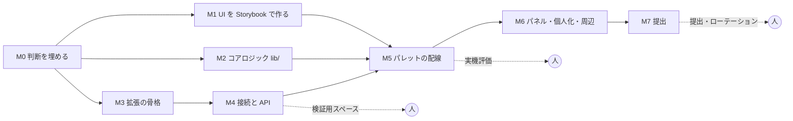

# マイルストーン

開発は Claude Code で進める。**実装の速さは律速にならない。** 律速になるのは次の 3 つで、計画はそれを中心に組む。

1. **人の判断**: `decisions.md` の要決定、見た目の確認、実機評価の合否
2. **人しか触れないもの**: 検証用スペースの API キー発行、OAuth アプリの登録、シークレットのローテーション、ストア提出
3. **CI の検証ゲート**: 型・ビルド・Storybook の層違反検査・story のテスト・E2E。ここを通るまで次へ進まない

したがって週数の見積もりは置かない。各マイルストーンは **完了条件（機械で検査できるもの）** と **人の工程（誰かがやる必要があるもの）** で定義し、
依存が無いものは並行して進める。

---

## 0. 依存関係

M1・M2・M3 は互いに依存しないので同時に走らせる。M4 は M3 の骨格ができれば着手できる。
**クリティカルパスは M0 → M3 → M4（スペース発行）→ M5（実機評価）→ M7 の人の工程。**

---

## M0. 判断を埋める — 完了（2026-09-13）

| | |
|---|---|
| 成果物 | `decisions.md` §1 の D-1〜D-16 に決定が入り、§3 に記録がある |
| 完了条件 | 「推奨」の語が要件文書に残っていない |
| 人の工程 | 全部。1 件ずつ確認した |

---

## M1. UI を Storybook で作る

`ui-components.md` §6 の順番で作る。**拡張機能を起動せずに全状態が見える**状態を作るのが目的。

| | |
|---|---|
| 成果物 | `components/` の全部品、`components/types.ts`、`components/labels/{ja,en}.ts`、`components/fixtures/`、`Palette` の S0〜S13、`SidePanel` の P1〜P5、接続シート・設定部品 |
| 完了条件 | CI 緑。`pnpm build:storybook` が通る（層違反ゼロ）。`pnpm test` で全 story が通る。`Palette` と `SidePanel` の全状態 story が共通の不変条件 play（I1・I2・I3・I5）を含む。両テーマ・両言語・幅 360 / 640 / 720 で描画が落ちない |
| 人の工程 | 公開された Storybook を見て、「非開発職が空状態を見て何を打てばいいか分かるか」を目視する。判断結果は `decisions.md` §3 へ。**見た目の細部（色・密度）は止めない。トークンで後から直せる** |
| 並行 | M2・M3 |

---

## M2. コアロジック（`lib/`）

React も拡張機能 API も知らない純粋ロジック。MVP の `packages/core` は形が残る見込みが高いので**参照してよい**（テストは持ち込まず、仕様として書き直す）。

| | |
|---|---|
| 成果物 | 正規化（NFKC・かな・ローマ字）、照合、ランキングと介入ルール、frecency、遷移パターン、スタック（`⇥` で積む規則を含む）、入力解釈（`>` `#` プレフィックス・課題キー）、キーマップの導出、結果の合流と保留、検索状態（パネルの条件を含む）と URL の codec、ページ定義、`document.title` の解析、文言辞書の型 |
| 完了条件 | `lib/**/*.test.ts` が vitest で通る（`vitest.config.ts` に `lib` のプロジェクトを足す。story と同じ `pnpm test` で走る）。テスト名は仕様（「課題キー完全一致は他候補の学習スコアがどれだけ高くても先頭に出る」「⌫ の 1 回目ではスタックは変わらず削除待ちになる」「全角の ＞ は半角と同じくコマンド絞り込みになる」「保留中の行は選択が先頭に戻るまで合流しない」） |
| 人の工程 | 無し |
| 並行 | M1・M3 |

---

## M3. 拡張の骨格

content script → iframe → Service Worker の線を通す。**MVP の罠（`mvp:docs/mvp-evaluation.md` §3）をここで全部踏み直さない。**

| | |
|---|---|
| 成果物 | iframe の先行注入と `open` / `close`（origin 検証つき）、content script での `⌘K` 捕捉（`commands` は使わない。D-10）、ストレージのスキーマとマイグレーション、`tabs.update` / `tabs.create` による遷移、表示キャッシュの収集、サイドパネルのエントリ、Firefox ビルドの出し分け、E2E の土台（偽の Backlog スペースを `--host-resolver-rules` で `demo.backlog.jp` に見せる。MVP の `e2e/fixtures` を参照） |
| 完了条件 | CI に E2E ジョブが増え緑。E2E で「`⌘K` → iframe が表示され入力欄に文字が打てる」「Esc で閉じる」「Backlog ページのスクリプトからパレットの DOM に到達できない」「変換中の Enter で遷移しない（CDP の `Input.imeSetComposition`）」「Backlog 以外のページでは `⌘K` がページに届く」が通る。ビルド後の `manifest.json` に content script・side_panel（Chrome）／sidebar_action（Firefox）が入り、`commands` に既定キーが無い |
| 人の工程 | 実機で 1 回だけ: `⌘K` → 表示が 100ms 以内に感じられるか、Backlog 本体のエディタや `⌘K` を使う画面で捕捉しない境界がどこか（未決 #4）。結果を `backlog-facts.md` に追記 |
| 並行 | M1・M2 |

---

## M4. 接続と API

| | |
|---|---|
| 成果物 | API キー接続の導線（発行ページ + メモ欄 + 貼り付けシート）、OAuth 副経路、`backlog-js` のラッパー（レート制御・スペースごとのトークン・429 の待ち）、`rateLimit` による初期化、マスタの先読み（プロジェクト・ステータス）、担当課題の取得、検索オーケストレーション（スペース × 種別の並列、push ストリーム、パネルの条件を `statusId[]` 等へ展開）、カスタムドメインの動的登録 |
| 完了条件 | 偽スペースの E2E で「未接続 → 接続 → 空状態に担当課題が出る」「1 スペースが 401 でも他の結果が出る」「429 で該当スペースだけが待ちになる」が通る。ユニットで「『完了を除く』はプロジェクトごとの statusId 集合に展開される」 |
| 人の工程 | **検証用スペースを用意し API キーを発行する**（人しかできない）。OAuth アプリの登録（Chrome の redirect URI。Firefox の URI も追加）。`backlog-facts.md` §5 の未確認 4・5・6・7・9・12 を実機で埋める（課題キーの先頭文字、小文字の URL、`/add/` のパス、`EditProject.action` の引数、カスタムドメインの形式） |
| 依存 | M3 |

---

## M5. パレットの配線

`entrypoints/palette/` と `entrypoints/popup/` が `lib/` と `components/` を繋ぐ。ここで `palette.md` の全状態が実機で成立する。

| | |
|---|---|
| 成果物 | 空状態、候補、課題キーのジャンプ、コピー、2 段階コマンド、スタック（`⇥` で積む）、検索セッション（起動・到着・保留・0 件・障害）、ローマ字変換、`#bl-search` の復元、`⌘⇧C`、`⌘→` の引き渡し（パネル側は M6） |
| 完了条件 | E2E が `palette.md` の状態 S0〜S13 を**押した結果で**検査する（行が出ることではなく、Enter でタブの URL が変わること、Tab で入力欄の値が変わること、フッターの各キーで対応する結果が起きること）。E2E に「フッターに表示されている全キーを順に押し、それぞれの結果が起きる」の通し検査がある（I2 の実機版） |
| 人の工程 | **実機評価。** 実スペースで `mvp-evaluation.md` §8 と同じ観点（打って・出て・選んで・着く）を通す。壊れていたら原因を要件の穴か実装の穴かに分けて記録。**ここが Phase 1 で一番大きな人の判断** |
| 依存 | M1・M2・M4 |

---

## M6. パネル・個人化・周辺

| | |
|---|---|
| 成果物 | サイドパネル（`⌘→` の受け取り、フィルターバー、ステータス帯、再検索、最近の検索、条件つき URL の共有と復元）、frecency と遷移パターンの反映、クエリ → 結果の学習、ブラウザ履歴の取り込み、stale-while-revalidate、設定画面（一覧・配色・言語・学習・消去・履歴・ショートカット・カスタムドメイン・計測）、i18n の配線、計測のローカル集計、Firefox のサイドバー |
| 完了条件 | E2E で「パレットで `⌘→` → パネルが同じ語とスコープで検索を起動している」「フィルターを変えると再検索され、選択行が動かない」「学習オフで行動ログが増えない」「履歴消去で表示キャッシュ・行動ログ・検索履歴が空になる」「`history` 未許可でも全機能が動く」。Firefox ビルドの E2E（最低限: `⌘K` とパレットの表示） |
| 人の工程 | 実機で英語表示を通しで見る。Firefox 実機で 1 回 |
| 依存 | M5 |

---

## M7. 提出

| | |
|---|---|
| 成果物 | ストア掲載物（日英の説明文は確定稿、スクリーンショット、アイコン）、プライバシーの説明（キーは端末内、計測はイベント種別のみ）、Firefox の `data_collection_permissions` と gecko id、README とサポート導線 |
| 完了条件 | `pnpm zip` / `pnpm zip:firefox` が CI で作れる。Phase 1 の完了の定義（§8）が全部 ✓ |
| 人の工程 | **計測の送信先と保持期間を決める**（決まるまで送信しない）。**OAuth シークレットのローテーション**。ストア提出。リポジトリを public にするなら `docs/reference` 相当の社内情報が無いことの確認 |
| 依存 | M6 |

---

## 8. Phase 1 の完了の定義

引き継ぎ資料の 13 項目（`mvp:docs/reference/backlog-palette-handoff.md` §7）を本要件に合わせて更新した。**E2E で検査できるものは E2E に置き、人が見るものは明示する。**

| # | 条件 | 検査 |
|---|---|---|
| 1 | `⌘K` からパレット表示まで 100ms 以内 | E2E（計測）+ 人（体感） |
| 2 | 空状態が API 応答を待たずに描画される | E2E（API を止めても空状態が出る） |
| 3 | 課題キー入力からジャンプまで `⌘K` + キー文字数 + `Enter` で完結する | E2E |
| 4 | 語を打って `Enter` で検索結果がパレットに出て、もう一度 `Enter` で先頭ヒットが開く | E2E |
| 5 | 全スペース検索で 1 スペースが遅延・認証切れでも他の結果が出る | E2E |
| 6 | 非同期の到着で選択行が動かない | E2E |
| 7 | IME 変換中の `Enter` で遷移しない。全角記号が半角と同じに扱われる | E2E（CDP） |
| 8 | Backlog ページのスクリプトからパレットの DOM・トークンにアクセスできない | E2E |
| 9 | 未接続・認証切れ・レートリミット・オフラインが行に閉じ、パレット全体がエラー画面にならない | E2E |
| 10 | 表示されている行とフッターの全キーに対応する動作がある | story の共通検査 + E2E の通し検査 |
| 11 | `Tab` でフォーカスがパレットから出ない | story + E2E |
| 12 | 設定から学習のオフ・履歴の消去ができ、実際にデータが消える | E2E |
| 13 | `history` 権限を許可しなくても全機能が動く | E2E |
| 14 | キーボードのみで全機能（パネル・設定・接続を含む）に到達できる | story（a11y addon）+ 人 |
| 15 | ライト／ダーク、日本語／英語のすべてで動く | story（両軸）+ 人（英語を通しで） |
| 16 | パレットの語を `⌘→` でパネルに渡し、条件で絞れる。Backlog 外のページでは `⌘K` を奪わない | E2E |
| 17 | Firefox で `⌘K`（`Ctrl+K`）とパレットが動く | E2E（Firefox） |
| 18 | 非開発職が空状態を見て何を打てばいいか分かる | **人**（M1 の目視、M5 の実機評価） |

---

## 9. テストの置き場所

| 対象 | 道具 | 何を問うか |
|---|---|---|
| `components/` | story の play function | 押した結果（ハンドラが呼ばれた、値が入った、フォーカスが残った） |
| `lib/` | vitest（ブラウザ不要） | 仕様としての入出力 |
| `entrypoints/` と全体 | Playwright + 偽スペース | タブの URL が変わった、クリップボードに入った、ストレージが消えた |

CI は前段が落ちても後続を走らせ、1 回で失敗を出し切る。ローカルで同じ検査を繰り返さない（`CLAUDE.md`）。
