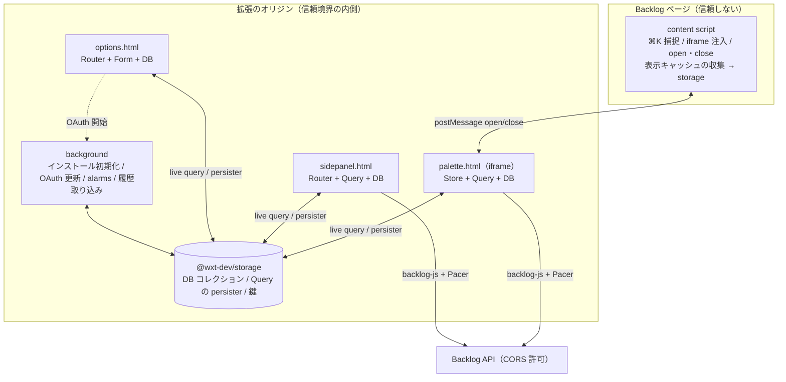

# 技術スタック

TanStack のエコシステムを軸にする。ライブラリは**層の規約**（`components/` は拡張機能 API を知らない、`lib/` は React を知らない）
の内側に収める。alpha / beta のものは `lib/` のモジュール 1 つに閉じ、差し替えがそこで済む形にする。

版は 2026-09-13 に npm で確認したもの。**exact で固定**し、更新は 1 パッケージ 1 コミットで行う。

## 1. 一覧

| 層 | 用途 | 採るもの | 版 | 安定度 | 決定 |
|---|---|---|---|---|---|
| 拡張の土台 | ビルド・manifest・エントリ | WXT | 0.21 | 安定 | 既定 |
| UI | 描画 | React | 19 | 安定 | 既定 |
| UI | 見た目 | Tailwind CSS v4（`@tailwindcss/vite`）+ Lightning CSS（Vite の `css.transformer`）+ `--bp-*` トークン | 4.3 / 1.33 | 安定 | D-18 |
| UI | アイコン | lucide-react | 1.45 | 安定 | 既定 |
| UI | 入力欄と競合しない部品（Popover・Switch・RadioGroup。Phase 2 で AlertDialog） | Radix Primitives（`radix-ui`） | 1.6 | 安定 | D-17 |
| UI | 候補リスト（listbox・仮想フォーカス） | **自前** | — | — | D-13 |
| UI | フォーム（接続シート・カスタムドメイン） | @tanstack/react-form | 1.33 | 安定 | T-9 |
| 状態 | パレットの状態（スタック・入力・セッション・トースト） | @tanstack/store（`lib/`）+ @tanstack/react-store（`entrypoints/`） | 0.11 | 事実上安定（Router の内部依存） | T-8 |
| 状態 | ルーティングと検索状態の URL 化 | @tanstack/react-router（サイドパネル・設定画面のみ） | 1.170 | 安定 | T-6 |
| データ | Backlog API の取得・キャッシュ・SWR | @tanstack/react-query（拡張ページごとに QueryClient）+ persister | 5.102 | 安定 | T-2 |
| データ | Backlog API クライアント | backlog-js（Nulab 公式）+ 自前の薄いラッパー | 0.20 | 安定 | T-4 |
| データ | レートリミット | @tanstack/pacer `asyncRateLimiter` | 0.23 | **beta** | T-7 |
| データ | ローカルデータの型つきコレクションと live query | @tanstack/db + @tanstack/react-db | 0.9 / 0.3 | **1.0 前** | T-1 |
| データ | 永続化 | @wxt-dev/storage（`storage.defineItem`） | 1.2 | 安定 | T-1 |
| データ | スキーマ検証（Standard Schema） | zod 4 | 4.6 | 安定 | T-3 |
| キー | キー定義の照合・表示 | @tanstack/hotkeys（`matchesKeyboardEvent` / `formatForDisplay` のみ） | 0.10 | **alpha** | T-5 |
| キー | 捕捉ループ（キャプチャ段階・isComposing） | **自前** | — | — | T-5 |
| メッセージ | content script ⇄ iframe | `window.postMessage`（自前。origin 検証つき） | — | — | 既定 |
| メッセージ | 拡張ページ ⇄ Service Worker | @webext-core/messaging | 4.0 | 安定 | 既定 |
| 品質 | lint・整形 | oxlint + oxfmt（`lollipop-onl/setup-linters` の設定） | 1.82 / 0.67 | 安定 | 既定 |
| 品質 | UI の仕様 | Storybook 10 + addon-vitest | — | — | 既定 |
| 品質 | 純粋ロジックの仕様 | vitest | 4 | — | 既定 |
| 品質 | 通しの検証 | Playwright + 偽スペース | — | — | 既定 |
| 開発 | Devtools | @tanstack/react-devtools（Storybook と `wxt dev` のみ） | — | — | 任意 |

**使わないもの**: @tanstack/react-virtual（行数は最大 30。仮想化が要らない）、@wxt-dev/i18n（文言は `components/labels` の辞書。D-11）、
react-aria-components（D-13 で `Autocomplete` / `ListBox` を外し、D-17 で Radix に置き換えた）、CSS Modules（D-18）、`chrome.commands` の既定キー（D-10）。

---

## 2. 実行コンテキストと責務

**Service Worker は薄い**（T-2）。認証情報の隔離は SW ではなく拡張のオリジンが作っている。拡張ページ（パレットの iframe・
サイドパネル・設定画面）は Backlog のページや content script から DOM も `storage.local` も読めないので、鍵をどこに置いても露出面は同じ。



| コンテキスト | やること | やらないこと |
|---|---|---|
| content script | `⌘K` の捕捉、iframe の注入と表示切替、`open` / `close`、表示キャッシュの収集（URL と `document.title` → storage）、`#bl-search` と `#bp-connect` の検出 | API 呼び出し、鍵の読み取り、パレット UI の DOM 生成 |
| 拡張ページ（palette / sidepanel / options） | UI、Backlog API の直接呼び出し、キャッシュ、ローカルデータの読み書き、`tabs.update` / `tabs.create` による遷移 | ページから受けた値で鍵を選ぶこと（§3） |
| Service Worker | インストール時の初期化、OAuth の認可フローとトークン更新、`alarms` によるマスタの TTL 更新、ブラウザ履歴の取り込み | UI、検索、日常の API 呼び出し |

### 信頼境界の規則（元の非交渉制約を、この配置で言い直したもの）

- どのスペースの鍵を使うかは、**拡張ページ自身が `tabs.query` で読んだタブ URL**で決める。content script が `open` に載せた `PageContext` はヒントであり、鍵の選択に使わない
- `postMessage` は双方向で origin を検証する。`targetOrigin` に `'*'` を使わない
- `components/` は拡張機能 API も鍵も知らない。props にトークンは現れない
- 遷移は拡張ページ → `tabs.update`。ページ側を経由しない
- `web_accessible_resources` は `use_dynamic_url: true`

---

## 3. データの流れ

### 3.1 Backlog API（TanStack Query + backlog-js + Pacer）

```
lib/backlog/client.ts     backlog-js を包む。スペースごとにインスタンス。応答ヘッダの X-RateLimit-* を読む
lib/backlog/rateLimit.ts  Pacer の asyncRateLimiter。スペース × 枠（read / search）ごとに 1 つ。上限は GET /rateLimit の実値で初期化し、
                          応答の Remaining で補正。429 は Reset まで待つ。状態は storage に書いてタブ間で共有する
lib/backlog/queries.ts    queryOptions のカタログ。キーは ['backlog', spaceKey, 'projects'] のように空間で始める
entrypoints/*/            QueryClient を 1 つ持ち、persister（@tanstack/query-persist-client-core + @wxt-dev/storage）でキャッシュを共有する
```

- **マスタ**（プロジェクト・ステータス）は `staleTime` 24h。パレットを開いたときにキャッシュから即描画し、裏で再取得する
- **担当課題**は `staleTime` 5 分。空状態の末尾に届いた時点で追記
- **検索**はスペース × 種別を `useQueries` で並列。1 スペースの失敗は他に影響しない。結果の合流と保留は `lib/search/merge.ts`（純粋関数）が行い、Query はキャッシュと再試行だけを担う。`⌘→` でパネルに渡すと同じキーで即ヒットする
- **表示キャッシュの SWR**（D-14）は、表示した行の課題キーを `useQueries` で再取得して DB コレクションを更新する

### 3.2 ローカルデータ（TanStack DB + @wxt-dev/storage）

```
lib/storage/items.ts        storage.defineItem の一覧。スキーマ版とマイグレーションをここに置く
lib/storage/collection.ts   defineItem を TanStack DB のコレクションにする adapter（1 つだけ）。
                            初期読み込み → getValue、変更 → setValue、他ページの変更 → item.watch で購読
lib/storage/collections.ts  displayCache / activity / searchHistory / queryDict / spaces / settings のコレクション定義（zod スキーマつき）
```

- 空状態の「最近開いた」は `useLiveQuery` で frecency 順に出す。並び替えのロジック（frecency の計算）は `lib/rank` の純粋関数で、live query はそれを呼ぶだけ
- content script は DB を使わず、`storage.defineItem` に直接書く（React も DB も持ち込まない）
- 鍵（API キー・リフレッシュトークン）は DB のコレクションにしない。`defineItem` を直接読む。live query の対象にすると UI のどこからでも購読できてしまう

### 3.3 パレットの状態（TanStack Store）

```
lib/palette/state.ts     Store<PaletteState>。stack / input / session / toast
lib/palette/reduce.ts    遷移の純粋関数。テストはここに書く
lib/palette/derive.ts    Derived: スコープ、候補セクション、KeyBinding[]（フッター）、selectedId
entrypoints/palette/     useStore で購読し、PaletteView に写して <Palette> に渡す
```

### 3.4 サイドパネルと設定（TanStack Router）

- パネルは 1 ルート。検索状態（語・スコープ・条件）を **zod で検証した search params** として持つ。`#bl-search` の codec はこの同じスキーマを使う
- 設定はセクションごとにルート。`hash` history（拡張ページの URL はサーバを持たない）
- パレットは Router を使わない。スタックの不変条件（右端からしか外せない）は履歴では表せない

### 3.5 キー（TanStack Hotkeys）

```
lib/keys/bindings.ts     KeyBinding = { id, hotkey: 'Mod+Enter', label, when(state) }。フッターはこの配列から描く（不変条件 I2）
lib/keys/match.ts        @tanstack/hotkeys の matchesKeyboardEvent で照合。formatForDisplay で ⌘ / Ctrl を OS に合わせる
components/organisms/Palette.tsx   キャプチャ段階の onKeyDown。isComposing なら捨て、bindings を上から照合して最初に合ったものを実行
```

HotkeyManager は使わない。入力欄にフォーカスがある状態での発火と `isComposing` の扱いを自前で握る。

### 3.6 フォーム（TanStack Form）

接続シートとカスタムドメインの追加。値の検証は zod、送信中・エラーの表示は Form の状態から描く。

---

## 4. 安定度への備え

| ライブラリ | 状態 | 備え |
|---|---|---|
| @tanstack/db | 1.0 前 | `lib/storage/collection.ts` の adapter 1 つに閉じる。API が変わってもここだけ直す。live query を使うのは空状態と設定画面の一覧だけ |
| @tanstack/pacer | beta | `lib/backlog/rateLimit.ts` に閉じる。インターフェースは `acquire(space, bucket): Promise<void>` の 1 つ |
| @tanstack/hotkeys | alpha | 使う関数は `matchesKeyboardEvent` と `formatForDisplay` の 2 つ。`lib/keys/match.ts` に閉じる |

いずれも exact 版で固定し、更新は CI が緑であることを確認して 1 パッケージずつ。

---

## 5. 実測が要る前提

`backlog-facts.md` §5 に追記済み。M3・M4 で確認する。

| # | 前提 | 崩れたときの退避 |
|---|---|---|
| 15 | `Backlog-API-Key` ヘッダ付きの fetch が CORS のプリフライトを通る | クエリ `?apiKey=` に切り替える（URL に鍵が残るので、履歴に残らない fetch だけで使う） |
| 16 | Web ページに埋めた拡張 iframe から Chrome・Firefox の両方で `tabs` API と cross-origin fetch が使える | 使えないブラウザでは iframe → SW にメッセージで委譲する（T-2 の別案の形に戻す） |
| 17 | `storage.defineItem` の `watch` が拡張ページ間で確実に届く（DB コレクションの同期の前提） | `storage.onChanged` を直接購読する |

---

## 6. 決定の記録

| 日付 | 項目 | 決定 | 理由 |
|---|---|---|---|
| 2026-09-13 | T-1 ローカルデータ | @wxt-dev/storage を永続化に、TanStack DB をその上の型つきコレクションと live query に | storage は安定、DB は 1.0 前。adapter 1 つで結ぶ |
| 2026-09-13 | T-2 API 呼び出し | 拡張ページから直接。SW は薄く | Backlog API は CORS 許可。隔離は拡張オリジンが作るので SW 経由の必然が無い |
| 2026-09-13 | T-3 スキーマ | zod 4 | Standard Schema。普及度 |
| 2026-09-13 | T-4 API クライアント | backlog-js + 薄いラッパー | Nulab 公式。レートヘッダはラッパーで読む |
| 2026-09-13 | T-5 Hotkeys | 定義・照合・表示に使い、捕捉ループは自前 | 入力欄フォーカス中の発火と isComposing を握る必要がある |
| 2026-09-13 | T-6 Router | サイドパネルと設定画面 | パレットのスタックは履歴で表せない |
| 2026-09-13 | T-7 レートリミット | Pacer の asyncRateLimiter | sliding window。状態は storage で共有 |
| 2026-09-13 | T-8 パレットの状態 | @tanstack/store（lib）+ react-store（entrypoints） | lib/ が React を知らない規約に合う |
| 2026-09-13 | T-9 Form | 使う | 検証・送信中・エラーの表示を統一 |
| 2026-09-13 | T-10 a11y 部品 | Radix Primitives。react-aria-components は採らない | D-17。Popover 級は自作せず、listbox を包まない headless primitives を使う |
| 2026-09-13 | T-11 見た目 | Tailwind CSS v4 + Lightning CSS | D-18。トークンは `@theme inline` で写し、ダークはトークンの再定義だけで追従する |
